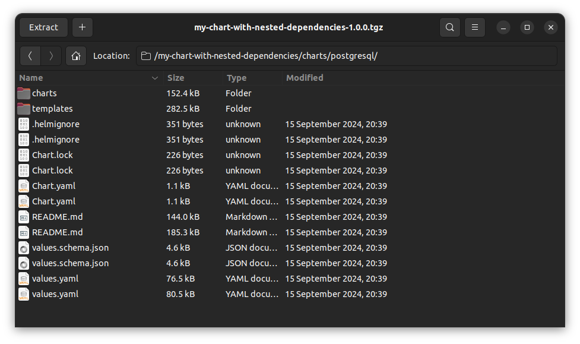
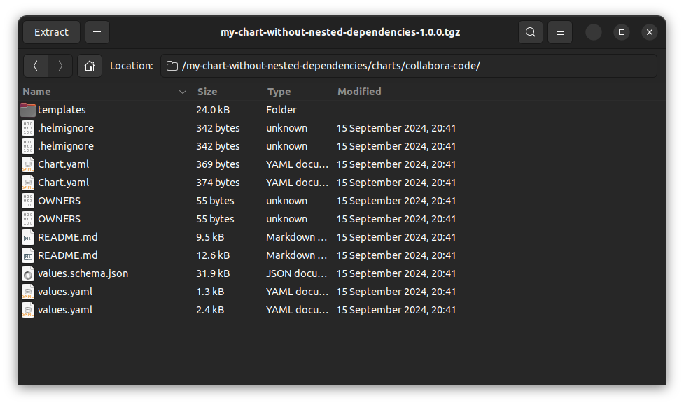

<!-- omit in toc -->
# Helm issue 11484 PoC

This repo was created to reproduce the [Helm issue no. 11484](https://github.com/helm/helm/issues/11484) and prove that the issue is related to the alias itself, not the sub-chart dependencies.

Helm CLI has a bug that affected aliased subcharts, where the behavior is even different between packed and unpacked charts.

More details in: [Do NOT use unpackaged Helm charts!](https://tech.aabouzaid.com/2024/06/do-not-use-unpackaged-helm-charts-devops.html) (an ugly workaround provided also)


- [Helm version](#helm-version)
- [1. Sub-chart alias WITH nested dependencies](#1-sub-chart-alias-with-nested-dependencies)
  - [1.2 Template **unpackaged** chart](#12-template-unpackaged-chart)
  - [1.2 Template **packaged** chart](#12-template-packaged-chart)
- [2. Sub-chart alias WITHOUT nested dependencies](#2-sub-chart-alias-without-nested-dependencies)
  - [2.1 Template **unpackaged** chart](#21-template-unpackaged-chart)
  - [2.2 Template **packaged** chart](#22-template-packaged-chart)
- [Conclustion](#conclustion)


## Helm version

```
# Released on 12th of September 2024
# https://github.com/helm/helm/releases/tag/v3.16.1
helm version
version.BuildInfo{Version:"v3.16.1", GitCommit:"5a5449dc42be07001fd5771d56429132984ab3ab", GitTreeState:"clean", GoVersion:"go1.22.7"}
```

## 1. Sub-chart alias WITH nested dependencies

The [PostgreSQL chart](https://artifacthub.io/packages/helm/bitnami/postgresql) is a dependency which also has a couple of sub-chart (the original issue reported in [Helm issue no. 11484](https://github.com/helm/helm/issues/11484)).

```yaml
# charts/alias-with-nested-dependencies/Chart.yaml
apiVersion: v2
name: my-chart
version: 1.0.0
appVersion: 1.0.0
dependencies:
  - name: postgresql
    alias: psql-14
    repository: https://charts.bitnami.com/bitnami
    version: 14.x.x
  - name: postgresql
    alias: psql-13
    repository: https://charts.bitnami.com/bitnami
    version: 13.x.x
```

Add chart repo repo:

```shell
helm repo add bitnami https://charts.bitnami.com/bitnami
```

### 1.2 Template **unpackaged** chart

When the chart is templated **unpackaged**, it actually works!

```shell
cd $(git rev-parse --show-toplevel)
cd charts/alias-with-nested-dependencies
helm dependency update
helm dependency build
helm template my-chart . | grep -o "Source: my-chart/charts/psql-../" | sort | uniq
```

Output:

```
# The chart is rendered as expected (we only grep tne path here)
Source: my-chart/charts/psql-13/
Source: my-chart/charts/psql-14/
```

### 1.2 Template **packaged** chart

When the chart is templated **packaged**, Helm CLI creates a single Frankenstein package called postgres which has some files from the Bitnami chart postgresql/13.x.x and postgresql/14.x.x!

```shell
cd $(git rev-parse --show-toplevel)
cd charts/alias-with-nested-dependencies
helm dependency update
helm dependency build
helm package .
helm template my-chart-with-nested-dependencies-1.0.0.tgz | grep -o "Source: my-chart/charts/psql-../" | sort | uniq
```

Output:

```
Error: template: my-chart/charts/psql-14/templates/networkpolicy-egress.yaml:6:18: executing "my-chart/charts/psql-14/templates/networkpolicy-egress.yaml" at <.Values.networkPolicy.enabled>: nil pointer evaluating interface {}.enabled

Use --debug flag to render out invalid YAML
```

The error is actually shown because, in the chart package, there is only 1 Postgres dir with files from both charts.



## 2. Sub-chart alias WITHOUT nested dependencies

It's the same if the aliased chart doesn't have any sub-charts.

The collabora-code chart is a simple chart [without any dependencies](https://github.com/chrisingenhaag/helm/blob/c48f99801f23b5838b4aa556e2be84cb7511a6c8/charts/collabora-code/Chart.yaml).


```yaml
# charts/alias-without-nested-dependencies/Chart.yaml
apiVersion: v2
name: my-chart
version: 1.0.0
appVersion: 1.0.0
dependencies:
  - name: collabora-code
    alias: cc-2-6
    repository: https://chrisingenhaag.github.io/helm
    version: 2.6.0
  - name: collabora-code
    alias: cc-2-0
    repository: https://chrisingenhaag.github.io/helm
    version: 2.0.0
```

Add chart repo repo:

```shell
helm repo add chrisingenhaag https://chrisingenhaag.github.io/helm/
```

### 2.1 Template **unpackaged** chart

When the chart is templated **unpackaged**, it actually works!

```shell
cd $(git rev-parse --show-toplevel)
cd charts/alias-without-nested-dependencies
helm dependency update
helm dependency build
helm template my-chart . | grep -o "Source: my-chart/charts/cc-2-.." | sort | uniq
```

Output:

```
# The chart is rendered as expected (we only grep tne path here)
Source: my-chart/charts/cc-2-0/
Source: my-chart/charts/cc-2-6/
```

### 2.2 Template **packaged** chart

Only one chart is rendered.

```shell
cd $(git rev-parse --show-toplevel)
cd charts/alias-without-nested-dependencies
helm dependency update
helm dependency build
helm package .
helm template my-chart my-chart-without-nested-dependencies-1.0.0.tgz | grep -o "Source: my-chart/charts/cc-2-.." | sort | uniq
```

Output:

```
Source: my-chart/charts/cc-2-6/
```



## Conclustion

Helm CLI generates dependencies based on the name of the chart and its repo (so the [workaround](https://tech.aabouzaid.com/2024/06/do-not-use-unpackaged-helm-charts-devops.html#workaround) is to copy the chart with a different name or a different repo).
